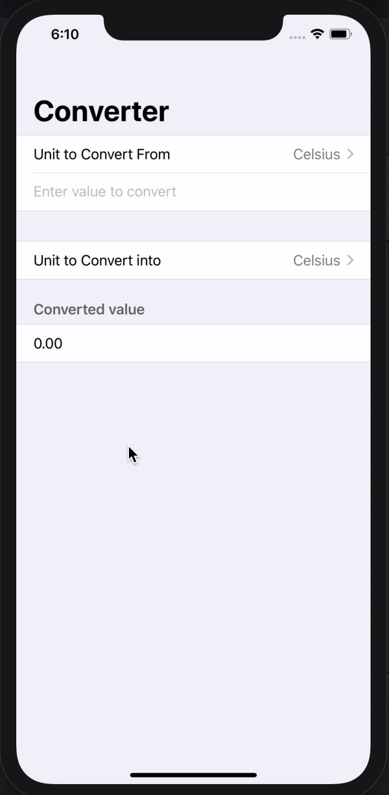

# TemperatureConverter

### Application made with *SwiftUI* that handles unit conversions: users will select an input unit and an output unit, then enter a value, and see the output of the conversion.

---

# Application Gif

